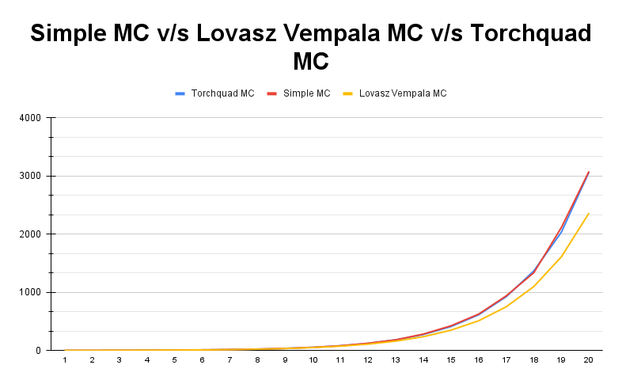
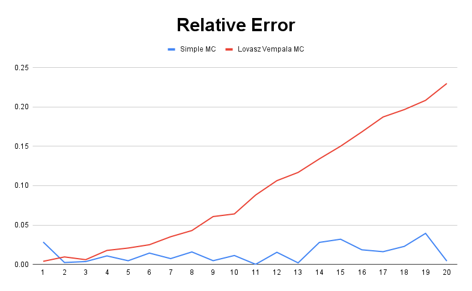
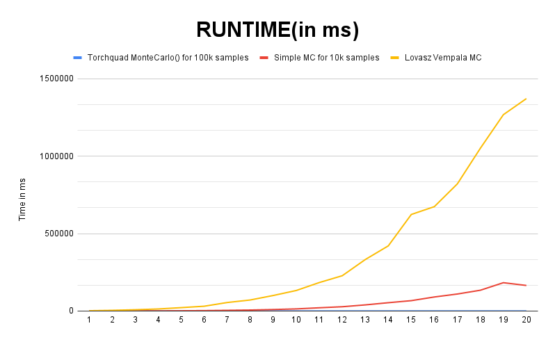

# LOVASZ-VEMPALA MONTE CARLO INTEGRATION TESTS

Link to the blog post: https://surajchoubey.github.io/gsoc21/lv-mc-integration/
  
Link to download and install torchquad: https://torchquad.readthedocs.io/en/latest/

## Testing details for integration of the function f(X) = exp(-||X||^2) for dimensions 1 to 20

### Using Torchquad Monte Carlo against Simple MC Integration:
Link to torchquad: https://torchquad.readthedocs.io/en/latest/

Link to Simple MC Integration: https://github.com/GeomScale/volesti/pull/163

| DIMENSIONS | TORCHQUAD   | RUNTIME     | SIMPLE MC | REL ERROR SMC   | RUNTIME |
| ---------- | ----------- | ----------- | --------- | --------------- | ------- |
| 1          | 1.492904544 | 3.103971481 | 1.53544   | 0.02849174537   | 41      |
| 2          | 2.2364223   | 3.122329712 | 2.24196   | 0.002476142212  | 123     |
| 3          | 3.327923059 | 3.527641296 | 3.34012   | 0.003665030807  | 319     |
| 4          | 4.977367878 | 5.724668503 | 5.03139   | 0.01085355219   | 671     |
| 5          | 7.451228619 | 5.999565125 | 7.41614   | 0.004709105091  | 1438    |
| 6          | 11.11701965 | 10.23459435 | 11.2774   | 0.01442655961   | 2418    |
| 7          | 16.56875992 | 10.91790199 | 16.6919   | 0.00743206386   | 4149    |
| 8          | 24.66317177 | 11.61623001 | 25.055    | 0.01588717929   | 6108    |
| 9          | 36.97853851 | 14.24241066 | 36.8022   | 0.004768671783  | 9514    |
| 10         | 54.88035965 | 18.69821548 | 55.5039   | 0.01136181239   | 13542   |
| 11         | 82.42194366 | 17.26961136 | 82.4361   | 0.0001717544481 | 20779   |
| 12         | 123.4812164 | 17.36044884 | 125.389   | 0.01544999008   | 27483   |
| 13         | 183.7014618 | 21.44908905 | 184.07    | 0.002006180051  | 39464   |
| 14         | 275.2875671 | 25.48241615 | 282.995   | 0.02799775137   | 53596   |
| 15         | 412.2122803 | 28.632164   | 425.418   | 0.03203621134   | 66841   |
| 16         | 614.3760376 | 31.12363815 | 625.798   | 0.01859115868   | 90542   |
| 17         | 924.3748169 | 32.8245163  | 939.349   | 0.01619925471   | 109751  |
| 18         | 1367.693604 | 36.95774078 | 1336.3    | 0.02295368161   | 134129  |
| 19         | 2034.100342 | 40.98439217 | 2114.41   | 0.03948166005   | 182812  |
| 20         | 3064.917725 | 46.57530785 | 3078.05   | 0.004284707314  | 164960  |

### Using Torchquad Monte Carlo against Lovasz Vempala MC Integration:
Link to torchquad: https://torchquad.readthedocs.io/en/latest/

Link to Lovasz Vempala MC Integration: https://github.com/pull/170

| DIMENSIONS | TORCHQUAD   | RUNTIME     | LV MC (W/O VOLM CORRECTION) | REL ERROR LVMC |
| ---------- | ----------- | ----------- | --------------------------- | -------------- |
| 1          | 1.492904544 | 3.103971481 | 1.49883                     | 0.003969079033 |
| 2          | 2.2364223   | 3.122329712 | 2.21504                     | 0.009560940407 |
| 3          | 3.327923059 | 3.527641296 | 3.30778                     | 0.006052741937 |
| 4          | 4.977367878 | 5.724668503 | 4.88881                     | 0.01779211023  |
| 5          | 7.451228619 | 5.999565125 | 7.29601                     | 0.02083127851  |
| 6          | 11.11701965 | 10.23459435 | 10.8386                     | 0.02504445094  |
| 7          | 16.56875992 | 10.91790199 | 15.9857                     | 0.03519031727  |
| 8          | 24.66317177 | 11.61623001 | 23.6016                     | 0.04304279183  |
| 9          | 36.97853851 | 14.24241066 | 34.7301                     | 0.06080387716  |
| 10         | 54.88035965 | 18.69821548 | 51.3594                     | 0.06415700757  |
| 11         | 82.42194366 | 17.26961136 | 75.1576                     | 0.08813603928  |
| 12         | 123.4812164 | 17.36044884 | 110.345                     | 0.106382305    |
| 13         | 183.7014618 | 21.44908905 | 162.238                     | 0.1168388187   |
| 14         | 275.2875671 | 25.48241615 | 238.385                     | 0.1340509763   |
| 15         | 412.2122803 | 28.632164   | 350.319                     | 0.1501490451   |
| 16         | 614.3760376 | 31.12363815 | 510.976                     | 0.168300896    |
| 17         | 924.3748169 | 32.8245163  | 751.293                     | 0.1872420297   |
| 18         | 1367.693604 | 36.95774078 | 1098.76                     | 0.1966329321   |
| 19         | 2034.100342 | 40.98439217 | 1610.31                     | 0.208342889    |
| 20         | 3064.917725 | 46.57530785 | 2360.67                     | 0.2297770407   |

## GRAPHS ADDRESSING ABOVE BENCHMARKS

### Integration Values

### Relative Error
Relative Error = (COMPUTED - EXACT)/EXACT

### RUNTIME (in ms)

